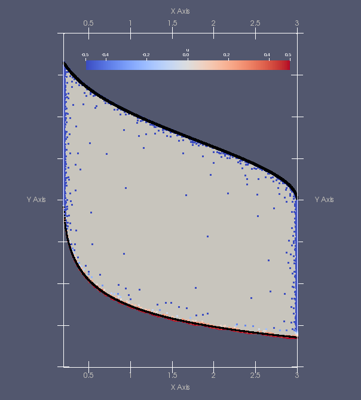

# Viabilitree

This library propose a set of algorithms, based on a particular kd-tree structure, in order to compute viability kernels and capture basins.

## Motivation
Mathematical viability theory offers concepts and methods that are suitable to study the compatibility between a dynamical system described by a set of differential equations and constraints in the state space. The result sets built during the viability analysis can give very useful information regarding management issues in fields where it is easier to discuss constraints than objective functions. Viabilitree is a framework in which the viability sets are represented and approximated with particular kd-trees. The computation of the viability kernel is seen as an active learning problem. We prove the convergence of the algorithm and assess the approximation it produces for known problems with analytical solution. This framework aims at simplifying the declaration of the viability problem and provides useful methods to assist further use of viability sets produced by the computation.


## Viability problem

### Simple example
#### Population Growth Model
This example is taken from [4]. The population model is Malthusian. The population viability problem consists in maintaining the size of a population in a given interval $`[a;b]`$. The state of the system is described by the variables $`x(t)`$, the size of the population, and $`y(t)`$, the population growth rate. The dynamics are described by the following equations:
```math
\left\{
\begin{array}{lll}
x(t+dt) &=& x(t)+x(t)y(t)dt\\
y(t+dt) &=& y(t)+u(t)dt  \text{  with  }  \left| u(t) \right| \leq c
\end{array}\right.
```
The dynamics are controlled by taking the growth rate evolution in interval $`[-c,c]`$. This viability problem can be resolved analytically (see [4]} for details). When $`dt`$ tends toward $`0`$, the theoretical viability kernel is defined by:
```math
Viab(K) = \left\{ (x,y)\in {\mathbb R}^2| \quad  x \in [a;b], y\in [-\sqrt{2c\text{log}(\frac{x}{a})}; \sqrt{2c\text{log}(\frac{b}{x})}] \right\}
```

[Figure 1: Viability kernel of the population viability problem][Figure 1]

[//]: # (*Figure 1: Viability kernel of the population viability problem*)


The above figure shows an approximation of the viability kernel for the population problem with:
* constraint set $`K=[a=0.2,b=3]\times[d=-2,e=2]`$, 
* parameters $`dt=0.1`$, 
* control set $`U=[-0.5;0.5]`$ with discretization step 0.02. 
The color stands for the value of a control $`u`$ which allows the state to stay in the viability kernel. In black the boundary of the true kernel.

**By definition of the viability kernel, starting from any point in the viability kernel, there exists always an evolution that stays in the viability kernel. Starting from any point outside the viability kernel, any evolution will exit the constraint set in finite time.** This is why the notion of viability kernel is so useful.

The corresponding code is the following:

For the definition of the model: dynamics, perturbations, etc.
```scala
import viabilitree.model.Dynamic

case class Population(integrationStep: Double = 0.01, timeStep: Double = 0.1) {

  def dynamic(state: Vector[Double], control: Vector[Double]) = {
    def xDot(state: Vector[Double], t: Double) = state(1) * state(0)
    def yDot(state: Vector[Double], t: Double) = control(0)
    val dynamic = Dynamic(xDot, yDot)
    val res = dynamic.integrate(state.toArray, integrationStep, timeStep)
    res
  }
```
_timeStep_ stands for to $dt$.
_integrationStep_ is a private parameter used by the _integrate_ method.


For the definition of the viability problem:
```scala
import scala.util.Random
import viabilitree.viability._
import viabilitree.export._
import viabilitree.kdtree.Tree
import viabilitree.viability.kernel._
import java.io.File

object PopulationViability extends App {
  // accuracy parameter
  val depth = 20
  
  // algorithm parameter  
  val rng = new Random(42)
  
  // model definition  
  val population = Population()
  
  // control parameter  
  def c = 0.5
  
  // constraint set parameters 
  def a = 0.2
  def b = 3.0
  def d = -2.0
  def e = 2.0
  
  // definition of the viability problem
  val vk = KernelComputation(
    dynamic = population.dynamic,
    depth = depth,
    zone = Vector((a, b), (d, e)),
    controls = Vector(-c to c by 0.02)
  )

  // computation of the viability kernel corresponding to problem vk
  val (ak, steps) = approximate(vk, rng)
  
  // save viability kernel to file (vtk format, to be processed by paraview)
  val f = new File(s"population${steps}depth${depth}.vtk")
  saveVTK2D(ak, f)
}
```
_a_ to _e_ are the same parameters as in the mathematical definition.

The viability problem is defined by class _KernelComputation_ with the following parameters:

* _depth_ which defines the accuracy of the approximation. There are $`2^{depth}`$ grid points (here, $`2^{\frac{depth}{2}}`$ points per axes).
* _dynamic_: the model dynamic
* _zone_: the area to explore and here it is also the constraint set, $`[a,b]\times[d,e]`$
* _controls_: the set of admissible controls, it is the same set for each state,$`[-c,c]`$

The computation itself is done by the _approximate_ function.

### Mathematical Viability Theory ([2], [3])
<a id="MVT"></a>
In Viabilitree we consider a viability problem defined by a controlled dynamical system $`S`$, a set-valued map $`U`$ (the set of admissible controls depending on the state of the system), and a compact subset $`K`$ of the state space (the set of constraints):
```math
(S)\left\{
\begin{array}{lll}
x'(t)&=&\Phi(x(t),u(t))\\
u(t)&\in & U(x(t))
\end{array}\right.
```
 $`x(t)`$ is the state of the system $`S`$, $`x(t)\in {\mathbb R}^p`$ a finite dimensional vector space.
 $`u(t)`$ is the control, with $`u(t)\in {\mathbb{R}}^q`$.
 The set-valued map $`U : {\mathbb R}^p\leadsto {\mathbb{R}}^q`$ gives the set of admissible control for each state $`x`$. $`\Phi`$ is a function from $`\text{Graph}(U)`$ to $`{\mathbb R}^p`$.
$`K\subset {\mathbb R}^p`$ is a compact subset of $`{\mathbb R}^p`$, it is the set of desirable states, the constraint set in which the state $`x(t)`$ is supposed to stay.

The viability kernel $`viab_S(K)`$ is the largest subset of $`K`$ (possibly empty) that gathers the states from which it is possible to find a control function $`u(t)`$ such that the evolution $`x(.)`$ stays in the compact set $`K`$.
```math
x\in viab_S(K) \Leftrightarrow  \exists u(.) \quad \forall t\geq 0 \left\{
\begin{array}{lll}
x'(t)&=&\Phi(x(t),u(t))\\
u(t)&\in & U(x(t))\\
x(t)&\in & K
\end{array}\right.
```
In Viabilitree we follow the method described in [5], we consider dynamical system ($`S_{dt}`$) discretized in time: 
```math
\begin{array}{lll}
F_{dt}(x)&=& \left\{ x+\Phi(x,u)dt, u \in U(x) \right\}.
\end{array}

```
We use the learning algorithm $`L`$ of kd-tree described in [1] on a discretized grid $`K_h`$ to compute an approximation $`L(K_h)`$ of the viability kernel $`viab_{S_{dt}}(K)`$ of the discretized dynamical system ($`S_{dt}`$) with constraint set $`K`$. When the learning algorithm and $`S_{dt}`$ verify some conditions, [1], [5] and [6] ensure that $`L(K_h)`$ converges to $`viab_S(K)`$ when $`h`$ and $`dt`$ tend to 0.

The convergence conditions are:
 * $`F`$ is [Marchaud][Marchaud] and $`\mu`$-[Lipschitz][Lipschitz] with closed images
 * $`K`$ is a compact set.
 * $`L(K^0)=K`$. 
 * $`viab_S(K)`$ is compact, it is path-connected 
 * $`viab_S(K)`$ erosion with $`B(\epsilon)`$ is path-connected and points of $`viab_S(K)`$ are at most distant from the eroded set by $`\epsilon \sqrt{p}`$
 * $`viab_S(K)`$ complementary set is path-connected as is its erosion with $`B(\epsilon)`$, and its points are at most distant from the eroded set by $`\epsilon \sqrt{p}`$.
The two last properties ensure that there are no small tentacles.

In practice points of the grid are removed from the current dilated approximation when following the dynamic with each available control they always leave the dilated approximation at the next step. See [KernelComputation][kernelLink] for implementation details.

More details on both theoretical and practical aspects in [7][viabilitree]

## Install
Coming soon
<!-- A rédiger après la mise en forme finale -->

## Use
The main purpose of **Viabilitree** is to help users to declare a viability problem, compute the corresponding viability kernel and possibly its capture basin, in order to perform a viability analysis.

Example of viability problems are gathered in package **example**. Each example is detailled in its own readme file.
 * [Bilingual][Bilingual] :
   - approximation of the viability kernel (BilingualViabDomain)
   - approximation of the capture basin of the viability kernel (BilingualBasin)
 * [Consumer][Consumer]
   - approximation of the viability kernel (ConsumerViability)
   - approximation of a set (the analytical kernel ) (ConsumerKernel)
 * [Population][Population]
   - approximation of the viability kernel (PopulationViability)
   - exploration with OpenMOLE (PopulationViability)
   - approximation of a set (the analytical kernel ) (PopulationApproximation)
  
To be completed

<!-- A rédiger après la mise en forme finale -->

#### References
[1] Rouquier et al, A kd-tree algorithm to discover the boundary of a black box hypervolume, _Annals of Mathematics and Artificial Intelligence_, vol 75, _3_, pp "335--350, 2015. 

[2] Aubin, _Viability theory_, Birkhäuser, 1991

[3] Aubin, Bayen, A. and Saint-Pierre, P. _Viability Theory: New Directions_, Springer, 2011.

[4] Aubin et Saint-Pierre, "An introduction to viability theory and management of renewable resources", chapter in _Advanced Methods for Decision Making and Risk Management_, J. Kropp and J. Scheffran eds., Nova Science Publishers, 2007

[5] Deffuant , Chapel,  Martin (2007). Approximating viability kernels with support vector machines. _IEEE T. Automat. Contr._, 52(5), 933–937.

[6] Saint-Pierre, P. (1994). Approximation of the viability kernel. _Applied Mathematics & Optimisation_, 29(2), 187–209.

[7] Alvarez, Reuillon, de Aldama. Viabilitree: A kd-tree Framework for Viability-based Decision. hal-01319738.

#### Remarks
<a name="Marchaud"></a>
A set-valued map $`F`$, non trivial, upper semicontinuous, with compact convex images is a Marchaud map if it has linear growth, that is there exists $`c > 0`$ such that $`\forall x, \  \sup _{y \in F(x)} \left\|y\right\| \leq c(\left\|x\right\|+1)`$.

<a name="Lipschitz"></a>
A set-valued map $`F`$ is $`\mu`$-Lipschitz with $`\mu>0`$ if for all $`x`$ and $`y`$, $` F(x)\subset F(y)+B(0,\mu ||x-y||)`$

<!-- Identifiers, in alphabetical order -->
[Bilingual]:example/READMEbilingual.md "Documentation for the example of the Bilingual society viability problem"
[Consumer]:example/READMEconsumer.md "Documentation for the example of the consumption model"
[kernelLink]:doc/READMEKernelComputation.md "Documentation for class KernelComputation"
[Lipschitz]: https://gitlab.iscpif.fr/viability/viabilitree/tree/master#Lipschitz "Definition of the Lipschitz property for dynamical systems"
[Marchaud]: https://gitlab.iscpif.fr/viability/viabilitree/tree/master#Marchaud "Definition of the Marchaud property for dynamical systems"
[Population]:example/READMEpopulation.md "Documentation for the example of the population growth model"
[viabilitree]: https://hal.archives-ouvertes.fr/hal-01319738v1 "Working paper with technical proofs"
<!-- [openmole]: http://www.openmole.org/ "OpenMOLE website: for numerical exploration of complex models" -->
